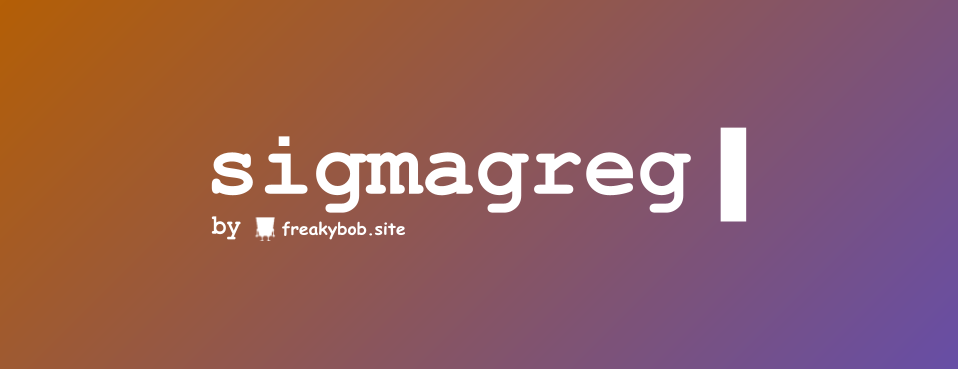
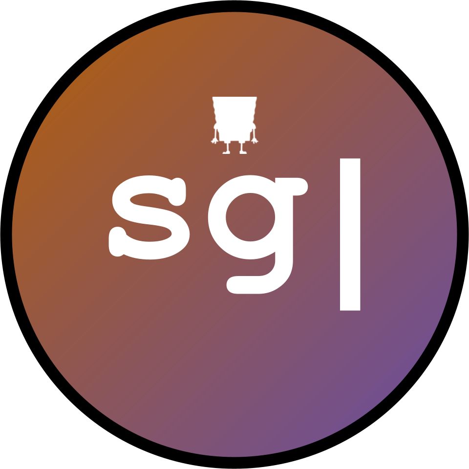

# 

<h1 align="center">SigmaGreg</h1>

<p align="center">
SigmaGreg is a simple "coding language" built in Python. Originally created in C++, SigmaGreg has evolved thanks to the peakness of Python, leaving C++ behind.
</p>

---

<h1 align="center">Commands</h1>

- **gregPr** - This command prints variables and text!
- **gregMa** - Allows you to do math! Ex: ```gregMa 2 + 2``` or ```gregMa answer 4 * 2```
- **gregIn** - Allows you to get input and changes value of variables!
- **gregWRITE** - So you can write more than 1 line of SigmaGreg Code!
- **gregRUN** - Runs the program you just made!
- **gregType** - Tells you what type of variable something is! Ex: ```Variable 'greg' is of type str greg```
- **gregRandom** - Get's a random number through 2 numbers you give! Ex: ```gregRandom 2 5```
- **gregPrintAll** - Prints all the variables and their values!
- **gregBeep** - Plays a beep sound!

---

<p align="center">
  2024-2025 Freakybob-Team. Everything is licensed under GPL-3.0.
</p>
<p align="center">

</p>
<p align="center">
  <small>This is still very new. Expect bugs.</small>
</p>
